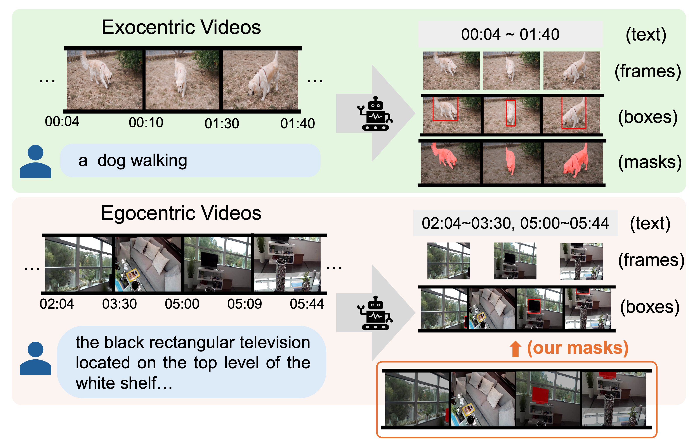
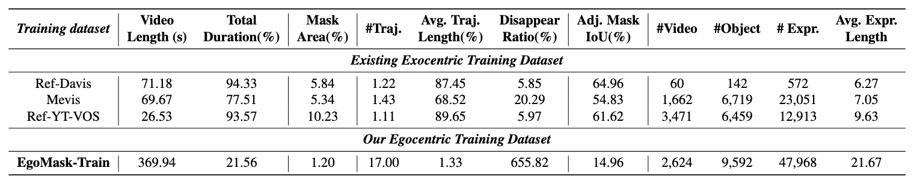
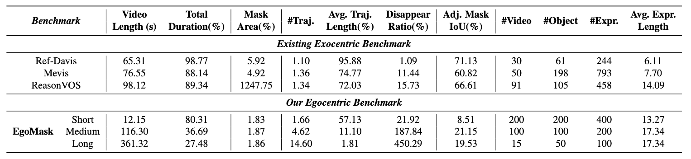

# EgoMask: Fine-grained Spatiotemporal Grounding on Egocentric Videos


<div align="center" margin-bottom="3em">
    <a href="https://arxiv.org/abs/2508.00518" target="_blank">
    </a>
    <a href="https://huggingface.co/datasets/XuuuXYZ/EgoMask" target="_blank">
    </a>
</div>

<br>

<div align="center" margin-bottom="3em">
<a target="_blank" href="https://github.com/ShuoLiang-98">Shuo LIANG</a>,
<a target="_blank" href="https://scholar.google.com/citations?user=irrbH_IAAAAJ&hl=en">Yiwu Zhong</a>,
<a target="_blank" href="https://henryhzy.github.io/">Zi-Yuan Hu</a>,
<a target="_blank" href="https://yeyao-tao.github.io/"> Yeyao Tao</a>,
 and
<a target="_blank" href="https://lwwangcse.github.io/">Liwei Wang<sup>&ddagger;</sup></a>

<sup>&ddagger;</sup> Corresponding author.

<br>
<strong>
The Chinese University of Hong Kong<br>
</strong>
<br>
</div>


---

## 📜 About

We focus on the fine-grained spatiotemporl grounding on egocentric videos.

Specifically, we conduct a  quantitative and systematic analysis of the discrepancies between egocentric and exocentric videos, revealing key challenges such as **shorter object durations**, **sparser trajectories**, **smaller object sizes**, and **larger positional shifts**.  
To address the absense of related datasets, we develop an automatic dat annotation pipeline and propose ***EgoMask***, the first pixel-level benchmark for fine-grained spatiotemporal grounding in egocentric videos, and  ***EgoMask-Train***, a large-scale training dataset to facilitate model development.  
Experiments demonstrate that existing state-of-the-art models struggle with egocentric videos but significantly improve when fine-tuned on our training data, while retaining performance on exocentric benchmarks.


<p align="center">
    <br>
    Comparison of video grounding tasks. We propose the first pixel-level benchmark for fine-grained spatiotemporal grounding in egocentric videos
</p>

## 🔔 News
- [2025-08-04] We release the evaluation code and fine-tuning code.
- [2025-08-01] We release the [paper](https://arxiv.org/abs/2508.00518) and [data](https://huggingface.co/datasets/XuuuXYZ/EgoMask).


## 📊 Dataset

We have provided the annotations in [Hugging Face](https://huggingface.co/datasets/XuuuXYZ/EgoMask).

See [dataset/README.md](dataset/README.md) for details.

<p align="center">
    <br>
    The statistics of <b/> EgoMask-Train </b> and the comparison with existing egocentric training datasets.
</p>

<br>

<p align="center">
    <br>
    The statistics of <b/> EgoMask </b>  and comparison with existing exocentric benchmarks.
</p>

> Note: 
> - **Total Duration (%)**: the percent of the total appearance of the objects. 
> - **Mask Area (%)**: the average area of the annotated mask over the frame size, which can reveal the object size. 
> - **\# Traj**: the number of object’s continuous trajectories throughout the video, where the **trajectory** is defined as one consecutive appearance in the video. 
> - **Avg. Traj. Length (%)**: the average of each trajectory duration over the whole video. 
> - **Disappear. Ratio(%)**: the mean of disappearance duration over trajectory duration. These two values (Avg. Traj. Length and Disappear. Ratio) can reveal the sparsity of the continuous trajectory. 
> - **Adj. Mask IoU(%)**: shows the positional shifts over the adjacent frames by calculating the IoU value of the masks of the target object. 
> - **Expr.**: refers to the expression.


## 🌟 Evaluation

***Prepare benchmark data***

1. Download this Repo.
```
git clone https://github.com/LaVi-Lab/EgoMask.git
```
2. Download dataset annotations and make sure the benchmark path is dataset/egomask.
```
cd EgoMask
hf download XuuuXYZ/EgoMask --repo-type dataset --local-dir dataset
```

3. Follow [dataset/README.md](dataset/README.md) to access Ego4D dataset and process benchmark images.
```
cd dataset
bash preprocess/process_refego.sh
bash preprocess/process_egotracks_for_benchmark.sh
```


### GroundedSAM2

Please follow this [repo](https://github.com/IDEA-Research/Grounded-SAM-2) to set up the environment & download models.
Then add the checkpoint paths and config paths in `scripts/eval_groundedsam2.sh` and run the following scripts.
```bash
# bash scripts/eval_groundedsam2.sh [DATASET_TYPE]
bash scripts/eval_groundedsam2.sh long
bash scripts/eval_groundedsam2.sh mid
bash scripts/eval_groundedsam2.sh short
```
### VideoLISA

Please follow this [repo](https://github.com/showlab/VideoLISA) to set up the environment & download models.
Then run the following scripts.
```bash
# bash scripts/eval_videolisa.sh [DATASET_TYPE] [MODEL_PATH]
bash scripts/eval_videolisa.sh long ZechenBai/VideoLISA-3.8B 
bash scripts/eval_videolisa.sh mid ZechenBai/VideoLISA-3.8B
bash scripts/eval_videolisa.sh short ZechenBai/VideoLISA-3.8B
```

### Sa2VA

Please follow this [repo](https://github.com/magic-research/Sa2VA) to set up the environment & download models.
Then run the following scripts.
```bash
# bash scripts/eval_sa2va.sh [DATASET_TYPE] [MODEL_PATH]
bash scripts/eval_sa2va.sh long ByteDance/Sa2VA-4B 
bash scripts/eval_sa2va.sh mid ByteDance/Sa2VA-4B
bash scripts/eval_sa2va.sh short ByteDance/Sa2VA-4B
```


## 🎯 Fine-Tuning

### Fine-tune VideoLISA
We use [VideoLISA-3.8B](https://huggingface.co/ZechenBai/VideoLISA-3.8B) as our base model. 

1. Follow [VideoLISA](https://github.com/showlab/VideoLISA) to set up environment and prepare data. The data structure should follows,
   ```
   ├─ videolisa_data/
       ├─ LISA_data/
       │   ├─ ade20k/
       │   ├─ coco/
       │   ├─ cocostuff/
       │   ├─ llava_dataset/
       │   ├─ mapillary/
       │   ├─ reason_seg/
       │   ├─ refer_seg/
       │   └─ vlpart/
       ├─ mevis/
       ├─ ReasonVOS/
       ├─ ref-davis/
       ├─ egomask-train/
       ├─ ref-youtube-vos/
       ├─ ReVOS/
       └─ YTVOS/
   ```

2. Use [utils/](src/training/videolisa/utils) and [train_joint.py](src/training/videolisa/train_joint.py) from `src/training/videolisa` to replace the original directory and file.

3. Copy [srcipts/FT_videolisa.sh](srcipts/FT_videolisa.sh) to the downloaded code repo and then run this script.


### Fine-tune Sa2VA
We use [Sa2VA-4B](https://huggingface.co/ByteDance/Sa2VA-4B) as our base model. 

1. Follow [Sa2VA](https://github.com/magic-research/Sa2VA/) to set up environment, download models, and prepare data. 
The data structure should follows,
   ```
   ├─ sa2va_data/
       └─ video_datas/
           ├─ rvos/
           ├─ mevis/
           ├─ revos/
           └─ egomask-train/
   ```
2. Copy files in [datasets](src/training/sa2va/projects/llava_sam2/datasets/), [models](src/training/sa2va/projects/llava_sam2/models/) and [configs](src/training/sa2va/projects/llava_sam2/configs/) from `src/training/sa2va/projects/llava_sam2` to the corresponding original directories.
   
3. Change model paths or config paths in ``projects/llava_sam2/sa2va_4b_FT_with_egomask-train.py`` if necessary.

4. Run the following scripts.
```
# Training Script
bash tools/dist.sh train projects/llava_sam2/configs/sa2va_4b_FT_with_egomask-train.py 8

# Convert trained model to huggingface format
python projects/llava_sam2/hf/convert_to_hf.py projects/llava_sam2/configs/sa2va_4b_FT_with_egomask-train.py --pth-model [PATH_TO_PTH_MODEL] --save-path [PATH_TO_SAVE_FOLDER]
```


## 🤝 Acknowledgements
We would like to thank the following works for their contributions to the opensourced codebase and community!
* [EgoTracks](https://ego4d-data.org/docs/data/egotracks/), [RefEgo](https://github.com/shuheikurita/RefEgo): the datasets we use.
* [Grounded-SAM2](https://github.com/IDEA-Research/Grounded-SAM-2), [Sa2VA](https://github.com/magic-research/Sa2VA), [VideoLISA](https://github.com/showlab/VideoLISA): We refer to these works for the data processing and evaluation setup. 


## 🚩 Citation
If you find our **EgoMask** useful for your research, please consider giving this repository a star and citing our paper as follows:
```
@article{liang2025finegrained,
      title={Fine-grained Spatiotemporal Grounding on Egocentric Videos}, 
      author={Shuo Liang and Yiwu Zhong and Zi-Yuan Hu and Yeyao Tao and Liwei Wang},
      journal={arxiv preprint arXiv:2508.00518},
      year={2025},
}
```
